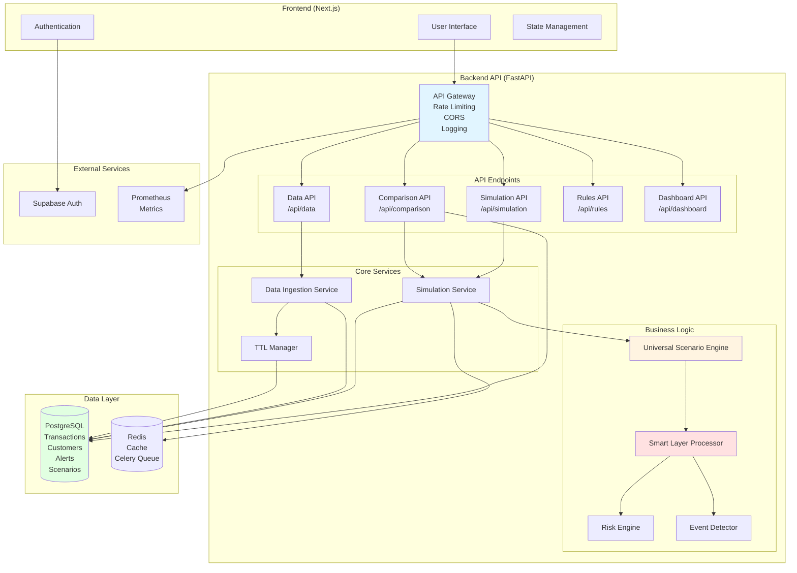
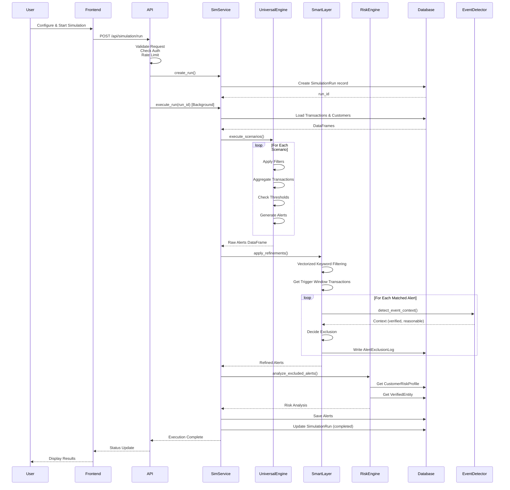
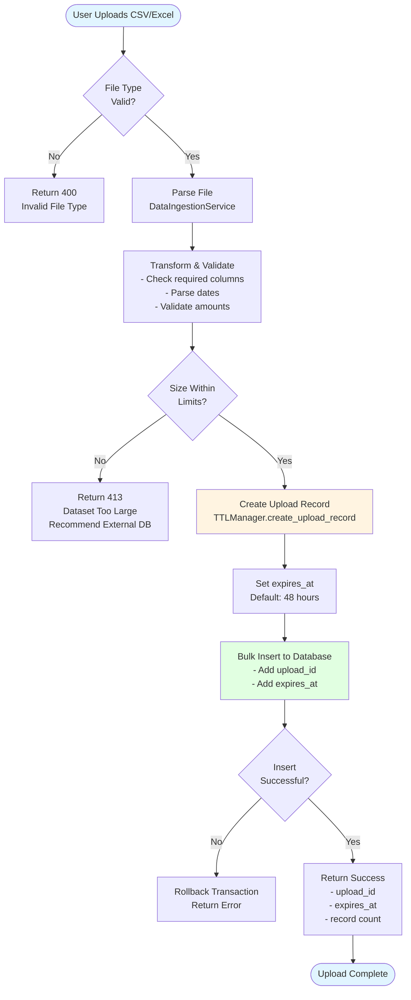
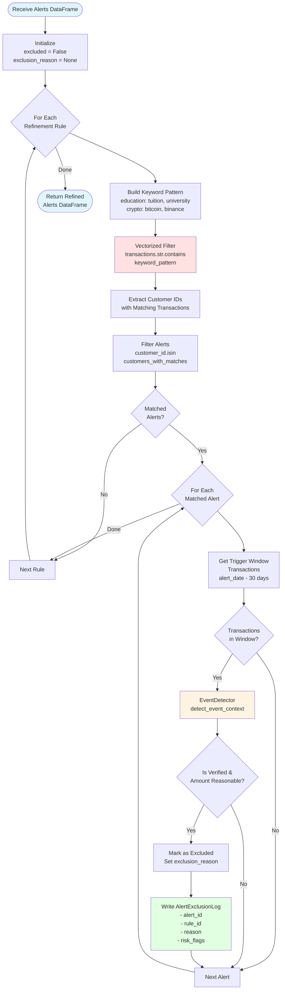
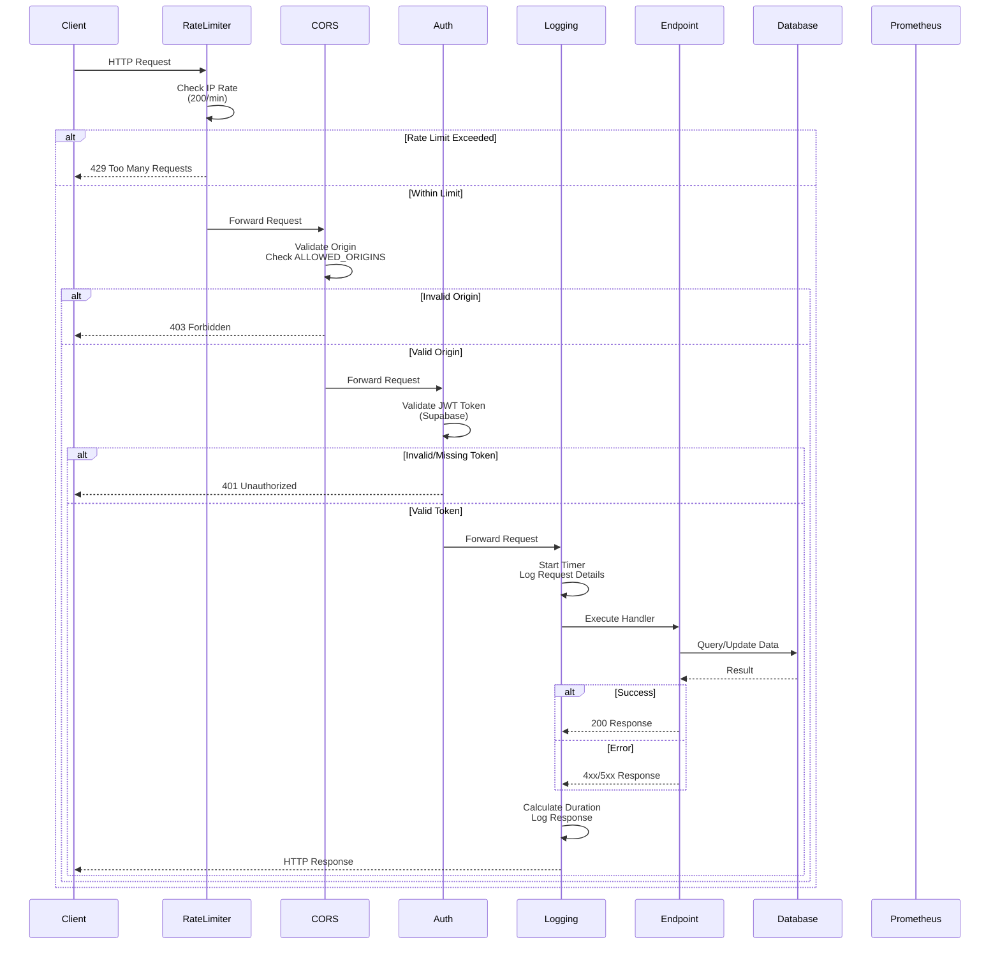
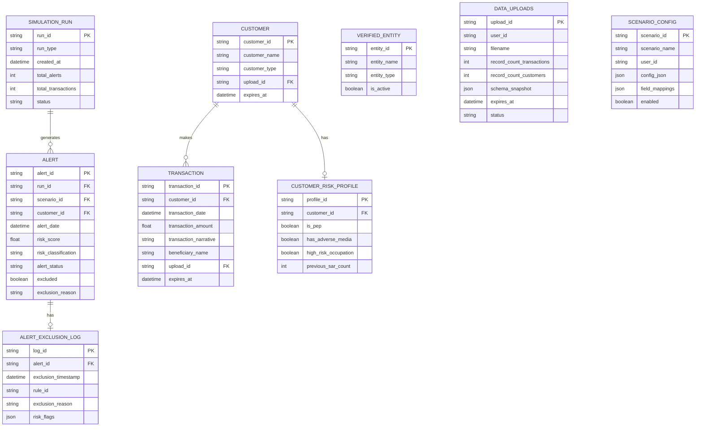
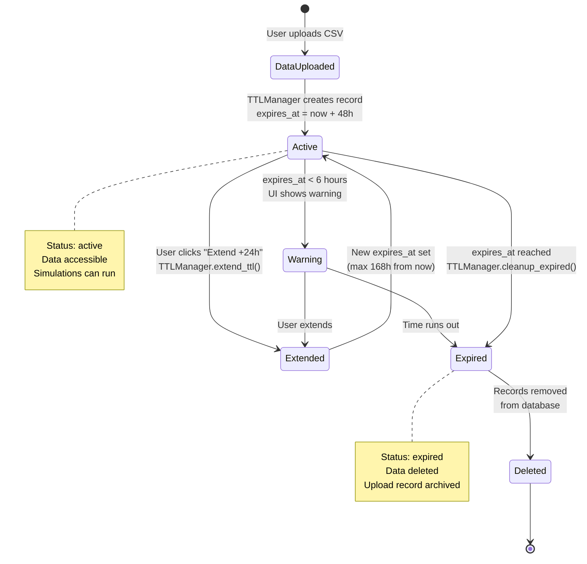
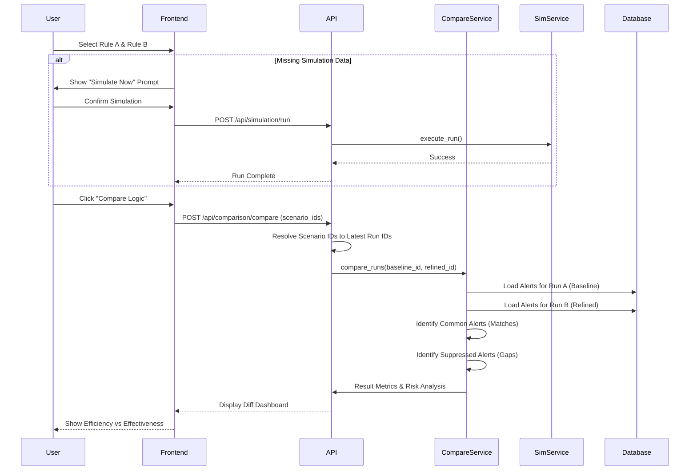

# SAS Sandbox Simulator - System Architecture & Flow Diagrams

## 1. High-Level System Architecture

## 2. Simulation Execution Flow

## 3. Data Ingestion Pipeline

## 4. Smart Layer Processing (Vectorized)

## 5. API Request Flow with Security

## 6. Database Schema Relationships

## 7. TTL Management Flow

## 8. Logic Comparison & Gap Analysis Workflow

## Legend

- **Blue boxes**: Entry/Exit points
- **Yellow boxes**: Processing/Computation
- **Red boxes**: Critical operations (filtering, exclusion, comparisons)
- **Green boxes**: Database operations
- **Diamond shapes**: Decision points
